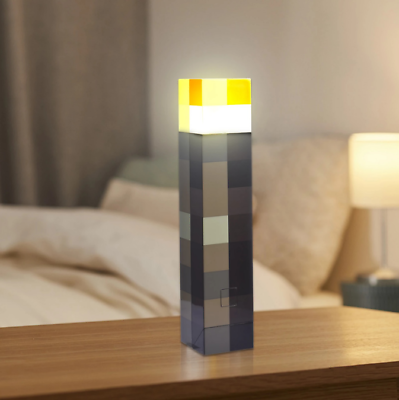

# Thunderboard Sense 2 Torch Light

## What is this?

This is a Zigbee Light running on [Thunderboard Sense 2](https://www.silabs.com/documents/public/user-guides/ug309-sltb004a-user-guide.pdf) *"the ultimate multi-sensor, multiprotocol cloud inspiration kit"*.
This is also my toy project, an attempt to learn the Zigbee Application Framework. The project is based on Zigbee 3 Light
example project, with some addional components like hall sensor, IMU sensor etc to provide an interface for light and device control.

## But why is it the Torch Light?

Well, my kids like playing Minecraft, I like playing Minecraft and when I saw this 
online, I just couldn't resist the impulsive buying and ordered a few. Although there's nothing wrong with those lights, I felt that it didn't fit well with all the other
lights in the house controlled by [Home Assistant](https://www.home-assistant.io/) Zigbee integration.
That's when I decided these lights to be Zigbee enabled.
However, instead of cutting open the lights, I opted to 3D print the [Minecraft Torch Nightlight][3d Source Torch Light] and designed a custom [torch head](3D%20Models/TBS2-Torch-Head.stl)
torch head to hold the TBS2 board. In the future, I'll need to find a replacement for TBS2. Although, [BRD2601b](https://www.silabs.com/documents/public/user-guides/ug524-brd2601b-user-guide.pdf)
supports Matter, it is a bit expensive. Alternatively, I might consider building a custom board because I haven't been able to find any other board that at least has an IMU and a microphone.

## Installation

### Installation using JLink Mass Storage Device

For the very 1st time, you would need to install both the boot loader and the application. For updates, you either could download just the app update or use the OTA imager for the over-the-air update.

Head over to [TBS2-Torch Release](https://github.com/Adminiuga/TBS2Torch/releases), find the a release with the bootloader, download the bootloader artifact and copy `app_btl-combined.s37` to `TB004` Thunderboard Sense 2 mass storage device. Once copied, the device will reboot.

Next, download the application artifact archive and copy `TBS2Torch.hex` to `TB004` mass storage device.

### Installation using Simplicity Commander

Alternatively, if you have [Simplicity Commander][Simplicity Commander] installed, you can use the simplicity commander to flash the same files. At least once, you would need to flash the `app_btl-combined.s37`, for the upgrades, just flash the `TBS2Torch.gbl` or `TBS2Torch.hex`

## User interface

### Buttons

#### Button 0

- Short duration press -- Toggle light
- Medium duartion press -- Dim light on/off over 5 seconds

#### Button 1

- Short duration press:
  - Indicate network status and Try to join network if is offline
    - Long Blink -- Network is Offline/Couldn't join
    - Three short blinks -- Network is Online
- Long duration press -- Leave network and try to join a new one

### IMU (accelerometer) sensor

Shaking the board/torch for longer than 0.75s, but less than 1.5s will toggle light on or off.

### Hall (magnetic field) sensor

Using the magnet you can toggle the light on or off, but also check for the network state or leave and rejoin network.
The hall sensor is located on the top of the board.

- bringing the magnet for the short duration (0.5s or so) will toggle the light
- Keeping the magnet near the board could be used to indicate the network state or forcing the device to leave and re-join the network. Keeping the magnet for longer than 3 seconds, will cause the light to turn on green color. If you remove the magnet once the light turns green, then the network state will be indicated as follows:
- Online -- Green blinkining
- Offline -- Red blinking

If you keep and don't remove the magnet once the light turns green, then after three seconds the light turns orange, after three more seconds light turns red and after three more seconds the light starts blinking red. If the magnetic field is still detected for 3 seconds while the light is blinking red, then the device will leave the current Zigbee network and starts attempts to join the new network. Removing the magnet during any of those steps aborts leaving the network.

## Temperature and humidity sensor

The application makes use of the temperature and humidity sensor, however, when using the micro-usb connector to power the, the LDO regulator generates heat which skews the temperature measurement. Same happens if the light is on, there's enough heat generated by the LED driver to skew the temperature measurement.

## Project building

### Building with Simplicity Studio

Currently, the project is built with [Gecko SDK 4.3.0][Current Gecko SDK]. To build the project with the Simplicity Studio v5 do the following:

1. Clone the [Torch Light][Torch Light GH] project onto your machine
2. In Simplicity Studio, import the project from `./TBS2Torch` folder of the cloned repository into your workspace
3. Force project generation and build the project

### Building locally

To build the project locally the build container can be reused. Simply start the container local with this repository bind-mounted as `/build`, e.g.

```bash
docker run --rm -it \
  --user builder \
  -v $(pwd):/build -v ~/.gitconfig:/home/builder/.gitconfig \
  ghcr.ilio/adminiuga/silabs-project-builder:4.3.0
```

Generate the project with

```bash
slc generate \"
  --with="EFR32MG12P332F1024GL125,brd4166a" \"
  --project-file="$(pwd)/TBS2Torch/TBS2Torch.slcp" \"
  --copy-sdk-sources \"
  --configuration="SL_IOSTREAM_USART_VCOM_RX_BUFFER_SIZE:32"
```

Next, apply the SDK patches:

```bash
pushd TBS2Torch/gecko_sdk_4.3.0
for patch in "../../patches/GeckoSDK"/*.patch
do
  echo "Applying ${patch}"
  patch -p1 < $patch
done
popd
```

Then build it with

```bash
pushd TBS2Torch
make -f TBS2Torch2.Makefile -j8 release
popd
```

Once the build is complete, the build artifacts are going to be in `./build/release` folder.

[Reference Table]: #
[Torch Light GH]: https://github.com/Adminiuga/TBS2Torch.git "TBS2 Torch Light Github Project"

[3d Source Torch Light]: https://www.thingiverse.com/thing:2002669 "3D Torch Light"

[Simplicity Commander]: https://community.silabs.com/s/article/simplicity-commander?language=en_US "Simplicity Commander"

[Current Gecko SDK]: https://github.com/SiliconLabs/gecko_sdk/releases/v4.3.0 "Gecko SDK"
